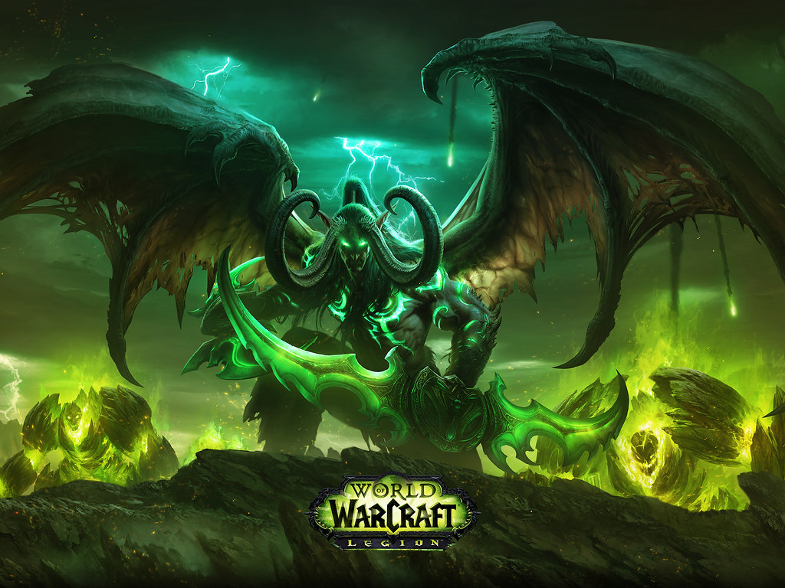
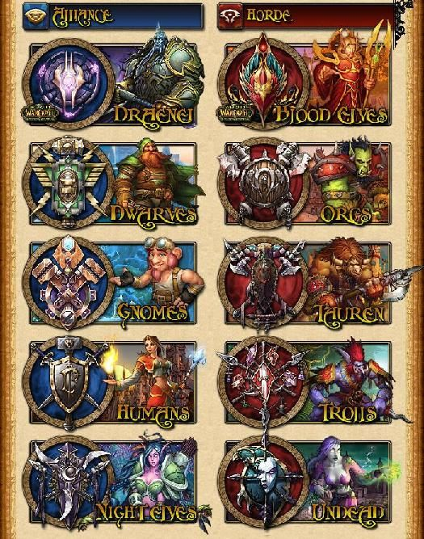
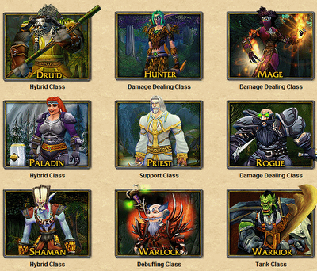
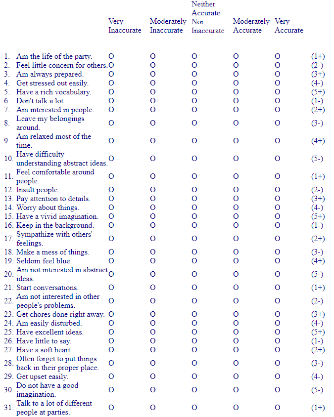
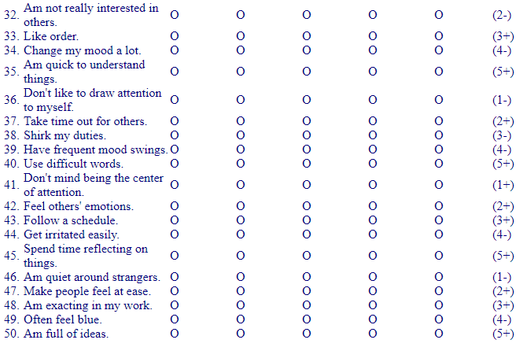
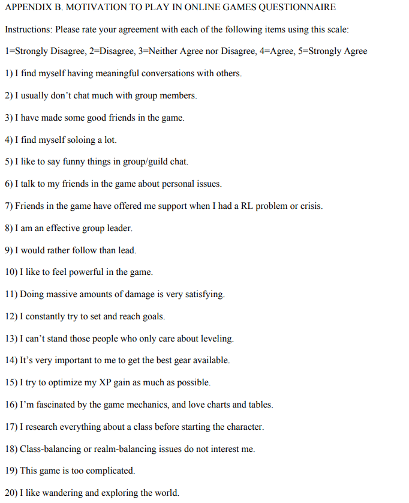
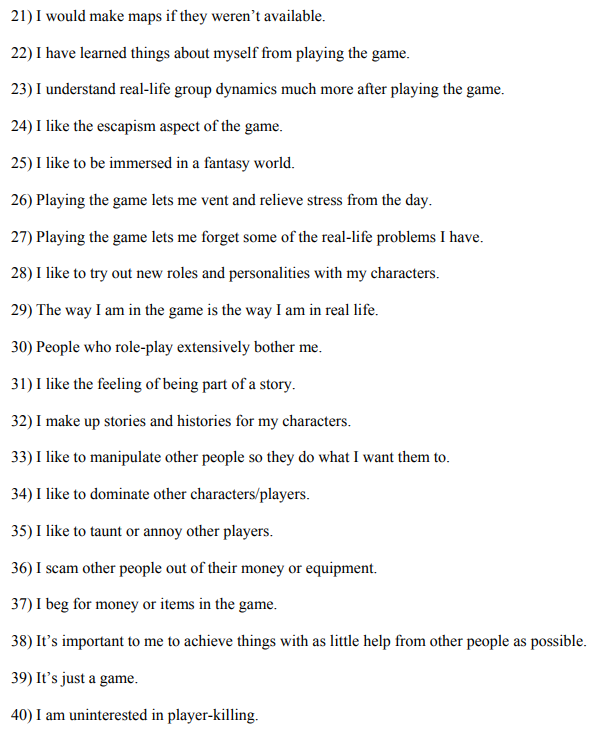
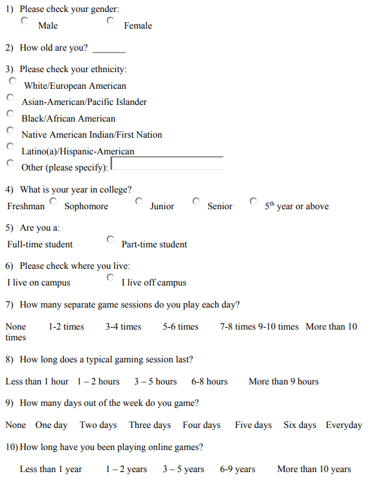
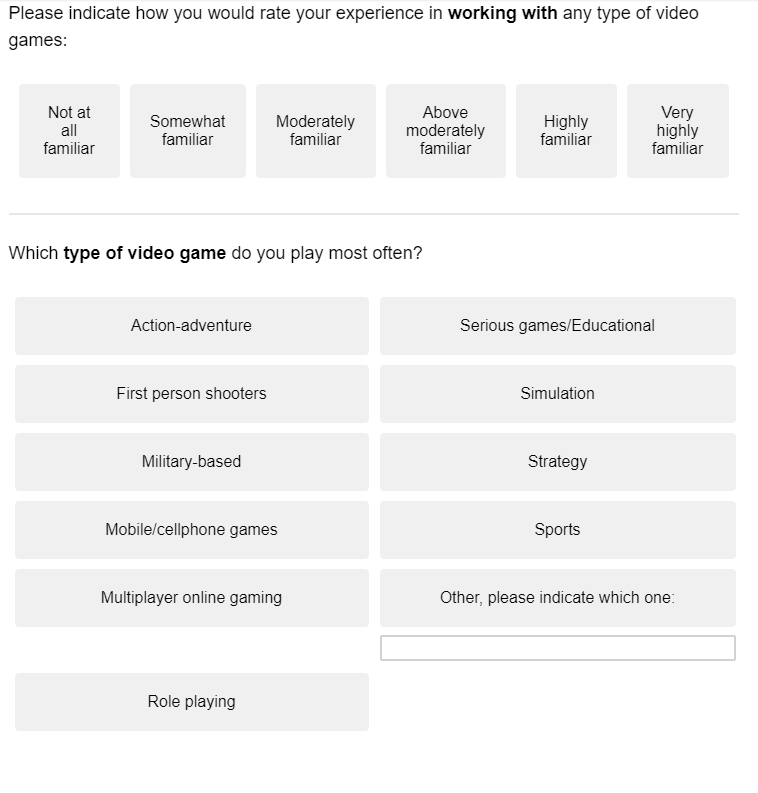

# Research Practicum 2019 – Research Plan

> * Group Name: Team WoW
> * Group participants names:
>> * Simon Soschinski
>> * Rhyse Bendell
>> * Jordan Dauble
>> * Emmanuel Otero
> * Project Title: A Mixed-Methods Analysis of Virtual Sociology in World of Warcraft

## Introduction

According to Newzoo (2017) the video game industry has already oustripped film as a source of personal entertainment, is generating over a hundred billion dollars of revenue a year, and is continuing to grow at an impressive rate. Increasingly, young people (though the average age of gamers continues to gradually increase as gaming generations age) turn to video games as their main source of entertainment (Billieux, Van der Linden, Achab, Khazaal, Paraskevopoulos, Zulllino, and Thorens, 2013), and the shift away from more traditional modes of hedonic activity has yeilded the age-old knee jerk reaction: what effect will this have on our children? The primary focus of academic discontent surrounding video games has so far centered on the impact of violent video games (VVGs), and has concerned the additional risk that engagement with violent content may have on one's disposition and behaviors. The argument condemning violent video games is in many ways similar to those that blossomed during the early years of the film industry - violence begets violence, desensitization will lead to inhumanity, etc. - but it differs along the key dimension of complicity. Gamers do not simply view the content with which they engage, but are in fact part of a bidirectional and developing relationship with the content of their game. Particularly as video games increase in complexity and provide less constricted avenues of play, a player may have the capacity to influence a game world to a greater degree than they are imprisoned by its rules. Here is where the question of violent activities and content raises a wholly different question than has already been answered with regards to film media; while we now know that simply viewing "The Patriot" or "John Wick" does not make one more prone to engaging in violent activity, available research cannot definitively say that actively enacting violence in a virtual space does not translate into reduced inhibition of violence in a real space (or - to avoid the double negative - that enacting violence does translate to reduced inhibition).  

The impact of violent video games on behavior is a nuanced topic that involves many levels of interaction between one's cognition and one's environment. When addressing the question of the interaction between external content and internal decision-making, we must acknowledge factors such as the nature of the violent content in question (sadistic, racial, sexual, impartially or chaotically violent, etc.), the role that one plays in engendering, facilitating, or perpetuating the violence, as well as the individual's perception of themselves as an active participant (note: this is by no means an exhaustive listing). Although the first two components may be readily quantified and discussed, the last presents many additional layers of obfuscation because it introduces factors not only of players' perceptions of the content with which they interact, but also their perceptions of themselves and the degree to which they perceive their interactions as meaningful or impactful at any level besides fulfilling a desire for play. Additionally, underlying factors may play a role in determining the actual, real-world impact of engaging with violent content. Past experiences, personality, social context, and other considerations may grossly outweigh simple descriptives of violent content when it comes to the actual impact of that content on an individual's congition and decision-making. Take, for example, a veteran who has personally experienced the realities of a battlefield versus an adolescent who has recently experienced bullying at school: when playing a game such as Call of Duty: World at War (admittedly violent, though historically informative) the former may engage with negative emotions due to the nature of the presented content and cease play with an increase in inhibition towards violent acts whereas the latter may thrive on the feelings of strength and power elicited from besting the in-game non-player-characters and walk away with a sense of boldness and desire to continue their feelings of power in the real world.  

Currently, it is unclear whether a directionality exists in the relationship between video gamers, the content they experience, and their subsequent behavior. The previously given example operates on the assumption that video game content has an effect on behavior which is mediated (or perhaps moderated) by past experience; however, many other solutions are equally likely. One approach that has been presented to shed some light on the equation of gamer-game-behavior relies on measurement of the inherent personality of gamers. Personality has been presented as a potential soluation to predicting behavior/preferences in many fields (to varying degrees of success), and lends itself here to addressing the ambiguity of whether game content on its own may significantly impact all gamers or whether content primarily influences those with an affinity or predisposition to its acceptance. This is a vital point in the argument for or against violent video games because assuming that violent video games are the driving force behind violent tendencies neglects the reality that gamers exist before and beyond the games they play.  

We chose to address one particular, but important aspect of the game-gamer relationship by focusing on the ability of inherent personality traits to predict players' choices in virtual worlds. Determining whether gamers' preexisting tendencies reliably impact their in-game choices is a vital first step to examining the effect of video games on behavior, and can provide insight into the most persistent variable in the equation: the players themselves. To accomplish this investigation, we built on the approach presented by Bean and Groth-Marnat (2016) who focused on the role of player personality on decision-making in the virtual environment of World of Warcraft. 

______

(What is World of Warcraft. 2 sentences)

(What options do players have. 2-3 sentences)
World of Warcraft (WoW) players have several choices during the course of creating and developing the virtual characters and personas that they control and embody. Players have initial choices regarding their character’s overarching alignment (Alliance versus Horde), race (Human, Dwarf, Tauren, Orc, etc.) and class (Hunter, Druid, Warlock, Rogue, etc.) as well as numerous decisions affecting gameplay (player versus environment; player versus player; role-playing) and social interactions as they delve into Blizzard’s virtual worlds.

(More detail on the ins and outs of WoW: focus on the races, character types, and classes. We want to relay enough detail to make it clear why one might choose a dwarf over a human, a tank over a healer, but not so much that we get lost in the weeds. 3-4 paragraphs, one each for races, classes, specializations/roles)

Classic Races  

Races  
  

Classes  
  

______
(Problem Statement. One paragraph to describe the prob-lem that you are tackling.)  

To date, little research has addressed why individuals make the choices they do - a surprising revelation considering that WoW has consistently been ranked as one of the most played Massive Multiplayer Online Roleplaying Games since its release in 2004. Notably, only two scientific studies (Bean & Growth-Marnat, 2016; Harari, Graham, & Gosling, 2015) have questioned the impact of players’ personalities on their decision-making despite the apparent role of individual differences in determining player preferences.   

______

(Proposed Solution. How do we propose to tackle this problem (that has been identified in the previous para-graphs, is interesting to the community, and has yet to be tackled by other researchers)?)

Research Question:

Bean and Groth-Marnat (2016) shared promising findings regarding the power of a Big Five Inventory based model to predict WoW players’ biological sex as well as their primary play-style; however, their model fell short of adequately predicting players’ character race, class, or specializations. It is possible that their investigation overlooked a major factor that would almost certainly confound the capacity of the model: player recurrence. Many veteran WoW players may choose to create a character and make choices in that character’s development that would not necessarily be driven by their personality, but rather by their previous experiences in the virtual world. Accordingly, the current investigation aims to replicate the investigation of Bean and Groth-Marnat (2016) by relying on a Big Five Inventory informed model to predict WoW players’ biological sex, chosen character sex, chosen alignment, chosen class, and preferred play-style with additional consideration of the effect that player recurrence may have on the model’s predictive power. In addition, this study will not only ask participants to indicate their preferences, but also request responses to a three-way decision set regarding each of the predicted variables (e.g., participants may indicate they prefer “cleric,” but when asked to choose between “priest, paladin, or death knight” they may choose paladin which more clearly delineates their class preferences) in order to avoid the pitfall of over-specificity which may lead to meaningless results.

 
Hypotheses:

(Note: the following will be tested against appropriate null hypotheses and will be presented as alternative hypotheses for sake of clarity of purpose)

H1a: Including the factor of player recurrence will lead to a significant increase in the predictive power of the Big Five Inventory (BFI) model along all dimensions.

[H1a note: Two reasons for the adjustment in power are posited – first the potential confusion of respondents to Bean and Groth-Marnat (2016) may have washed out any effect that could have been found, and by clarifying to respondents that the interest of the investigation is in their “primary” or “innately preferred” character development it may be that their responses will more truly relate to the questions of interest. ]

H2a: A combination of higher Extraversion scores, lower Agreeableness scores, lower Neuroticism scores, and lower Openness scores will predict players’ biological sex such that those scores will correspond with male respondents.

[H2a note: WoW is one of the few MMORPGs that draws a more nearly equal ratio of male and female players and therefore represents an interesting data set that may comment on the general traits of male and female video game players]

H3a: A combination of higher Extraversion and lower Neuroticism scores will positively predict player preferences towards PvP play-styles as opposed to RP or PvE.

H4a: Participants’ personality traits will not significantly predict their free-responses to queries regarding race and class.

H5a: Participants’ personality traits will predict their responses to three-choice forced queries regarding race and class.

H6a: A combination of increased Conscientiousness scores, increased agreeableness scores, and decreased Extraversion scores will predict players’ alignment such that those exhibiting those traits will be more likely to align with Alliance forces than the Horde.
______
Measures:

Big Five Index  
  
  

Motivation to Play Online Games  
  
  

Demographics   
  
  
______

(Contributions. An enumeration of the contributions of the senior design project)

•	The current work will serve to replicate previous findings that have been reported in the literature (Bean & Groth-Marnat, 2016) regarding player preferences in World of Warcraft and the relationship between those preferences and players' self-reported personality traits  
•	This project will also serve to extend the findings of Bean and Groth-Marnat (2016) by manipulating probe phrasing to provide insight into whether players intentionally choose avatars that reflect their perception of themselves, or whether they make their choices based on intrique or learning as a result of prior experience.  
•	Additionally, this project will shed light on the directionality of the relationship between personality and play style which is a significant and often overlooked factor of the supposed imapct of violent video games.  

______

## Related Work

Discuss briefly about published matter that technically relates to your proposed work in 4-5 paragraphs.

## References 
(Using APA citations)

Bean, A., & Groth-Marnat, G. (2016). Video gamers and personality: A five-factor model to understand game playing style. Psychology of Popular Media Culture, 5(1), 27.

Billieux, J., Van der Linden, M., Achab, S., Khazaal, Y., Paraskevopoulos, L., Zullino, D., & Thorens, G. (2013). Why do you play World of Warcraft? An in-depth exploration of self-reported motivations to play online and in-game behaviours in the virtual world of Azeroth. Computers in Human Behavior, 29(1), 103-109.

Dunn, R. A., & Guadagno, R. E. (2012). My avatar and me–Gender and personality predictors of avatar-self discrepancy. Computers in Human Behavior, 28(1), 97-106.

Jimenez, N., San-Martin, S., Camarero, C., & San Jose Cabezudo, R. (2019). What kind of video gamer are you?. Journal of Consumer Marketing, 36(1), 218-227.

Halim, Z., Atif, M., Rashid, A., & Edwin, C. A. (2017). Profiling players using real-world datasets: Clustering the data and correlating the results with the big-five personality traits. IEEE Transactions on Affective Computing.

Harari, G., Graham, L., Gosling, S. (2015). Personality Impressions of World of Warcraft Players Based on Their Avatars and Usernames Consensus but No Accuracy. International Journal of Gaming and Computer-Mediated Simulations, 7(1), 58-73.

Newzoo. (2017). The global games market will reach $108.9 billion in 2017 with mobile taking 42%. Retrieved from https://newzoo.com/insights/articles/the-global-games-market-will-reach-108-9-billion-in-2017-with-mobile-taking-42/

Weiss, A., & Tettegah, S. (2012). World of race war: Race and learning in World of Warcraft. International Journal of Gaming and Computer-Mediated Simulations (IJGCMS), 4(4), 33-44.

TO REVIEW:

Ask, K., & Sørensen, K. H. (2019). Domesticating technology for shared success: collective enactments of World of Warcraft. Information, Communication & Society, 22(1), 73-88.

Fernandes, L. V., Castanho, C. D., & Jacobi, R. P. (2018, October). A Survey on Game Analytics in Massive Multiplayer Online Games. In 2018 17th Brazilian Symposium on Computer Games and Digital Entertainment (SBGames) (pp. 21-2109). IEEE.

Delhove, M., & Greitemeyer, T. (2018). The relationship between video game character preferences and aggressive and pro-social personality traits. Psychology of Popular Media Culture, 11.

Siqueira, E. S., Castanho, C. D., Rodrigues, G. N., & Jacobi, R. P. (2017, November). A data analysis of player in world of warcraft using game data mining. In 2017 16th Brazilian Symposium on Computer Games and Digital Entertainment (SBGames) (pp. 1-9). IEEE.

Bainbridge, W. S. (2016). Virtual sociocultural convergence. Springer International Publishing.

Hornbeck, R. G. (2016). Explaining time spent in multiplayer online games: Moral cognition in Chinese World of Warcraft. Games and Culture, 11(5), 489-509.

Root, R. (2016). Navigating Sociotechnical Power Structures: Dynamics of Conflict in World of Warcraft's Player versus Player Events.

Bean, A. M., Ferro, L. S., Vissoci, J. R. N., Rivero, T., & Groth-Marnat, G. (2016). The emerging adolescent World of Warcraft video gamer: A five factor exploratory profile model. Entertainment Computing, 17, 45-54.

Ferro, L. (2016). Projekt. ID: investigating how game elements and mechanics can be aligned to players preferences.

Sapach, S. C. (2015). The WoW Factor: A Virtual Ethnographic Study of Sacred Things and Rituals in World of Warcraft.

Bean, A. M. (2015). Video gamers' personas: A five factor study exploring personality elements of the video gamer. Pacifica Graduate Institute.

Golub, A. (2014). The anthropology of virtual worlds: world of warcraft. Reviews in Anthropology, 43(2), 135-149.

Hutchinson, E. (2014). Researching forums in online ethnography: Practice and ethics. In Big Data? Qualitative Approaches to Digital Research (pp. 91-112). Emerald Group Publishing Limited.

Kirschner, D. (2014). Gameplay Socialization: Meaning-Making, Player-Computer and Player-Player Interaction in Digital Games (Doctoral dissertation, PhD dissertation, Nanyang Technological University).

Voulgari, I., Komis, V., & Sampson, D. G. (2014). Learning outcomes and processes in massively multiplayer online games: exploring the perceptions of players. Educational Technology Research and Development, 62(2), 245-270.

Bainbridge, W. S. (2012). The Warcraft civilization: Social science in a virtual world. MIT Press.

Evans, S. (2012). Virtual selves, real relationships: An exploration of the context and role for social interactions in the emergence of self in virtual environments. Integrative psychological and behavioral science, 46(4), 512-528.

Williams, J. P., & Kirschner, D. (2012). Coordinated action in the massively multiplayer online game World of Warcraft. Symbolic Interaction, 35(3), 340-367.

SONSTROEM, P. (2012). The Reality of Virtual Realities: An in Depth Glimpse at the Interactions That Occur Within the Online Gaming Communities of World of Warcraft and Continuum (Doctoral dissertation, Durham University).

McKenna, B., Gardner, L., & Myers, M. (2011). Social movements in World of Warcraft. In 17th Americas Conference on Information Systems.

Ahmad, M. A., Borbora, Z., Shen, C., Srivastava, J., & Williams, D. (2011, October). Guild play in MMOGs: rethinking common group dynamics models. In International Conference on Social Informatics (pp. 145-152). Springer, Berlin, Heidelberg.

Spottke, J. C. (2010). Ethnographic Reflection On Group Formation In Blizzard's" world Of Warcraft".

Mosley, Ian D. (2010) "Personality and Character Selection in World of Warcraft," McNair Scholars Research Journal: Vol. 6 : Iss. 1 , Article 12.
Available at: https://scholarworks.boisestate.edu/mcnair_journal/vol6/iss1/12

De Paoli, S. (2010). My Life as a Night Elf Priest. An Antropological Account of World of Warcraft.
