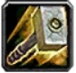
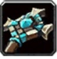
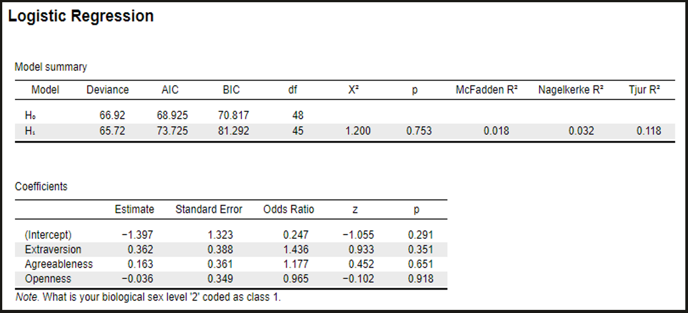

# Research Practicum 2019 – Research Plan

> * Group Name: Team WoW
> * Group participants names:
>> * Simon Soschinski
>> * Rhyse Bendell
>> * Jordan Dauble
>> * Emmanuel Otero
> * Project Title: A Mixed-Methods Analysis of Virtual Sociology in World of Warcraft

# Introduction
According to Newzoo (2017) the video game industry has already oustripped film as a source of personal entertainment, is generating over a hundred billion dollars of revenue a year, and is continuing to grow at an impressive rate. Increasingly, young people (though the average age of gamers continues to gradually increase as gaming generations age) turn to video games as their main source of entertainment (Billieux, Van der Linden, Achab, Khazaal, Paraskevopoulos, Zulllino, and Thorens, 2013), and the shift away from more traditional modes of hedonic activity has yeilded the age-old knee jerk reaction: what effect will this have on our children? The primary focus of academic discontent surrounding video games has so far centered on the impact of violent video games (VVGs), and has concerned the additional risk that engagement with violent content may have on one's disposition and behaviors. The argument condemning violent video games is in many ways similar to those that blossomed during the early years of the film industry - violence begets violence, desensitization will lead to inhumanity, etc. - but it differs along the key dimension of complicity. Gamers do not simply view the content with which they engage, but are in fact part of a bidirectional and developing relationship with the content of their game. Particularly as video games increase in complexity and provide less constricted avenues of play, a player may have the capacity to influence a game world to a greater degree than they are imprisoned by its rules. Here is where the question of violent activities and content raises a wholly different question than has already been answered with regards to film media; while we now know that simply viewing "The Patriot" or "John Wick" does not make one more prone to engaging in violent activity, available research cannot definitively say that actively enacting violence in a virtual space does not translate into reduced inhibition of violence in a real space (or - to avoid the double negative - that enacting violence does translate to reduced inhibition).  

The impact of violent video games on behavior is a nuanced topic that involves many levels of interaction between one's cognition and one's environment. When addressing the question of the interaction between external content and internal decision-making, we must acknowledge factors such as the nature of the violent content in question (sadistic, racial, sexual, impartially or chaotically violent, etc.), the role that one plays in engendering, facilitating, or perpetuating the violence, as well as the individual's perception of themselves as an active participant (note: this is by no means an exhaustive listing). Although the first two components may be readily quantified and discussed, the last presents many additional layers of obfuscation because it introduces factors not only of players' perceptions of the content with which they interact, but also their perceptions of themselves and the degree to which they perceive their interactions as meaningful or impactful at any level besides fulfilling a desire for play. Additionally, underlying factors may play a role in determining the actual, real-world impact of engaging with violent content. Past experiences, personality, social context, and other considerations may grossly outweigh simple descriptives of violent content when it comes to the actual impact of that content on an individual's congition and decision-making. Take, for example, a veteran who has personally experienced the realities of a battlefield versus an adolescent who has recently experienced bullying at school: when playing a game such as Call of Duty: World at War (admittedly violent, though historically informative) the former may engage with negative emotions due to the nature of the presented content and cease play with an increase in inhibition towards violent acts whereas the latter may thrive on the feelings of strength and power elicited from besting the in-game non-player-characters and walk away with a sense of boldness and desire to continue their feelings of power in the real world.  

Currently, it is unclear whether a directionality exists in the relationship between video gamers, the content they experience, and their subsequent behavior. The previously given example operates on the assumption that video game content has an effect on behavior which is mediated (or perhaps moderated) by past experience; however, many other solutions are equally likely. One approach that has been presented to shed some light on the equation of gamer-game-behavior relies on measurement of the inherent personality of gamers. Personality has been presented as a potential solution to predicting behavior/preferences in many fields (to varying degrees of success), and lends itself here to addressing the ambiguity of whether game content on its own may significantly impact all gamers or whether content primarily influences those with an affinity or predisposition to its acceptance. This is a vital point in the argument for or against violent video games because assuming that violent video games are the driving force behind violent tendencies neglects the reality that gamers exist before and beyond the games they play.  

Several previous studies have examined player motivations in World of Warcraft and their relationship with player retention. (Debeauvais et. al 2011, Siqueira et. al 2018). This data is critical to determining player resubscription rates that will affect the ability of the gaming company to maintain the game and develop new expansions. Other researchers have examined real-life player characteristics, such as finding that MMO players are less religious and more physically fit on average than the general population. (William et. al 2008). One study found that female MMO users are on average older than male players and that players under the age of 18 are almost entirely male (Yee, 2006). Apart from Bean, the Big Five Inventory model has been applied to World of Warcraft and other games by attempting to classify in-game player personalities by combining a survey of a subset of users with machine learning analysis of game usage data (Halim 2017). After interviewing players in China, Hornbeck (Hornbeck 2016) found that certain players expressed improved social skills such as how to make friends, honesty, communication, group coordination, spiritual encouragement, and the importance of justice. Hornbeck's results showed that specific character groups correlate with moral activation, such as female healers having strong in-game moral experiences and tanks responding well to authority stimuli.

We chose to address one particular, but important aspect of the game-gamer relationship by focusing on the ability of inherent personality traits to predict players' choices in virtual worlds. Determining whether gamers' preexisting tendencies reliably impact their in-game choices is a vital first step to examining the effect of video games on behavior, and can provide insight into the most persistent variable in the equation: the players themselves. To accomplish this investigation, we built on the approach presented by Bean and Groth-Marnat (2016) who focused on the role of player personality on decision-making in the virtual environment of World of Warcraft. 

______

### What is World of Warcraft.

World of Warcraft (WoW) is a Massive Multiplayer Online Roleplay Game (MMORPG) released by video game developer and publisher Blizzard Entertainment, Inc. in 2004. The game had it's highest subscriber numbers in 2010 with over 12 Million people playing worldwide. Though Blizzard decided not to make the official player number public anymore in 2015 due to decreasing numbers, estimations still guess the current subscriber number of 2 - 3.5 Million, wich still makes WoW the most popular MMORPG.
WoW started in its so called Vanilla version in 2004, and 7 expansion packs with more content (e.g., new races and classes, new areas) and changes/adjustments to the gamestyle were added since. Following the wish of the community of gamers, Blizzard re-released a version of "Vanilla WoW", called WoW Classic.
We decided to focus our research on the Classic Version of WoW for two reasons, (1) the fewer options of races and race/class combination as well as the basic versions of class designs (referring to gamestyle) made player choices feel more impactful, (2) the release of Classic saw a certain hype by the player community, making subjects for the survey more easily accessable.

##### Player Choices

WoW takes place in the so called Warcraft Universe, a setting that is also used by the real time strategy games Warcraft 1 (Orcs and Humans), Warcraft 2 (Tides of Darkness), Warcraft 3 (Reign of Chaos), including their individual expansion packs, as well as a plethora of books and other media. For a quick introduction into the world, see also [**The official Game-Trailer**](https://www.youtube.com/watch?v=vlVSJ0AvZe0&t=41s).
The WoW Universe is takes the player to the fictional world of Azeroth, inviting them to create a virtual character and slip into the role of this character to embody and develop it. Players have a number of initial choices regarding character which will be explained in detail:

##### Fraction:

Each character in WoW belongs to one of two possible fractions, the Alliance or the Horde.

| Alliance   | Horde   |
|:---:|:---:|
|  |  |

In Classic WoW, four races belong to each fraction:
Noble Humans, adventurous Dwarfs, enigmatic Nightelves, and ingenious Gnomes form the Alliance 
while brutal Orcs, shadowy Undead, spiritual Tauren, and quick-witted Trolls make up the horde (race-describing adjectives taken from the in-game description).

##### Races:

As mentioned, the player can choose from 8 different races in Classic WoW. The table below gives a quick overview of the individual races:

| Alliance Races   | Horde Races   |
|:---:|:---:|
|  |  |
| Human | Orc |
|  |  |
| Dwarf | Undead |
|  |  |
| Nightelve | Tauren |
|  |  |
| Gnome | Troll |

All pictures were taken from the [**WoW Head Dressing Room**](https://www.wowhead.com/news=291960/wow-classic-model-viewer-spotlight-create-your-character-in-the-dressing-room)

##### Classes:

After having chosen a race, a player in WoW will then be able to pick a class. Players in WoW fulfill a certain role referring to their playstyle. In general, 3 roles can be distinguished: Tanks, Healer, and Damage-Dealer (DPS, short for damage per second). Not every class can fulfill every roll, some classes have different perks and traits that will benefit a certain role, and not every class can be picked by every race. As mentioned, players therefore are asked to make further initial choices to take a certain path with their character creation. The tables and images below list the different classes and roles they can fulfill.

| Classname   | Icon   | Role   |
|:---:|:---:|:---:|
| Druid |  | Tank, Healer, DPS |
| Hunter |  | DPS |
| Mage |  | DPS |
| Paladin |  | Tank, Healer, DPS |
| Priest |  | Healer, DPS |
| Rogue |  | DPS |
| Shaman |  | Healer, DPS |
| Warlock |  | DPS |
| Warrior |  | Tank, DPS |

Furthermore, the player may chose one of three general playstyles/server (in WoW called Realm) modes, being Player-vs-Environment (PvE), Player-vs-Player (PvP), or Roleplaying (RP).

| Game Mode   | Description   |
|:---:|:---|
| PvE | PvE focusses on besting enemies not controlled by other players but by the game (Non-Player characters, NPCs). |
| PvP | In PvP, players tend to compete with other players in different competitions (e.g., 1v1 in open world skirmishes, or group activities like 10v10 capture the flag operations or similar). |
| RP | In RP, the players will concetrate more on the role playing nature of the game, focussing more on embodying their character and socialize within the game world. |

There is no strict distinction between the three game modes and parts of every mode can and will to a certain degree be present in all of them.

Role description:

Tank

Tanks make up the frontline in a fight against non-player enemies. They are equiped with strong armor and have a large healthpool at their disposal. This enables them to withstand strong attacks. Tanks use their skillset and toolkit to draw the enemies attentien and have them focus their attacks on themselves.

Healer

Healers choose from a number of beneficial spells of their skillset in order to refill the healthbars of their party members. While a tank may survive several hits of an enemy, over time he would get worn down. A healer enables the party to keep going with the fight and also safes his allies should they be carelessly taking damage.

DPS

It is the job of the damage dealers to bring an enemies hitpoints to zero before the healer runs out of mana (which is the magic energy spellcasters use to perform their spells) and the tank and then inevitably the rest of the group dies. In order to perform well, a DPS player needs to know his skilset and optimize the use of his skills so that he will put out as much damage as possible in a given timeframe. 

Furthermore, it is important for every type of player to avoid taking unnecessary damage. Therefore, some form of awareness for the surroundings of each player as well as some knowledge of upcoming fights is needed.

______

##### The Present Study
To date, little research has addressed why individuals make the race, class, specialization, and playstyle choices that they do - a surprising revelation considering the prominence of World of Warcraft and the size of its player-base. Notably, only two scientific studies (Bean & Groth-Marnat, 2016; Harari, Graham, & Gosling, 2015) have questioned the impact of players’ personalities on their decision-making despite the apparent role of individual differences in determining player preferences. Bean and Groth-Marnat (2016) shared promising findings regarding the power of a Big Five Inventory based model to predict WoW players’ biological sex as well as their primary play-style; however, their model fell short of adequately predicting players’ character race, class, or specializations. It is possible that their investigation overlooked a major factor that would almost certainly confound the capacity of the model: player recurrence. Many veteran WoW players may choose to create a character and make choices in that character’s development that would not necessarily be driven by their personality, but rather by their previous experiences in the virtual world. We aim to more clearly investigate the influence of recurrence and perceived relation to one's avatar by administering two sets of WoW focused queries (random assignment): one which specifies "if you [the player] were to be creating a new character..." another which specifies "if you [the player] were making a character which best represented you...".

The current investigation aims to replicate the investigation of Bean and Groth-Marnat (2016) by relying on a Big Five Inventory informed model to predict WoW players’ biological sex, chosen character sex, chosen alignment, chosen class, and preferred play-style with additional consideration of the effect that player recurrence may have on the model’s predictive power. Further, this study will not only ask participants to indicate their preferences, but also request responses to a reduced set of options regarding each of the predicted variables (e.g., rather than choosing from all races, players may be asked to choose "human" or "orc"). The purpose of presenting reduced options is to examine whether individual differences may have predictive power that is insufficient for capturing response patterns across all possible options, but may be sufficient to predict more clearly stratified decisions. 

The BFI is a 44 question measure of personality traits, Openness, Conscientiousness, Extraversion, Agreeableness, and Neuroticism (recently the model was referred to as OCEAN, now it tends to be called BFI)(John & Srivastava, 1999). The model has been employed in a wide range of psychological, social, and clinical studies to predict various behavioral and performance outcomes ranging from engagement with new technologies to tendency towards addiction. The BFI has a history of succesful application in the world of video games, and has recently been a cornerstone of research investigating the effect of violent video games and individual differences (Bean, 2015; Bean, Ferro, Vissoci, Rivero, & Groth-Marnat, 2016; Delhove & Greitemeyer, 2018)

 
Models built on the personality traits measured by the BFI typically rely on general-linear modelling (often analyzed as the special case of multiple analysis of variance presented by Bean and Groth-Marnat (2016), though other forms of regression based analysis are also effective (see Crawford & Brandt, 2019; Kaspi-Baruch, 2017)) to predict outcomes based on the five measured personality traits. Such approaches allow researchers to investigate the relationships between each trait and predicted variables such as those of interest in the present study. Particularly, we anticipate the following predictive outcomes from our investigation:
 
##### Hypotheses: 

(Note: the following will be tested against appropriate null hypotheses and will be presented as alternative hypotheses for sake of clarity of purpose)

H1a: Including the factor of player recurrence will lead to a significant increase in the predictive power of the Big Five Inventory (BFI) model along all dimensions.

[H1a note: Two reasons for the adjustment in power are posited – first the potential confusion of respondents to Bean and Groth-Marnat (2016) may have washed out any effect that could have been found, and by clarifying to respondents that the interest of the investigation is in their “primary” or “innately preferred” character development it may be that their responses will more truly relate to the questions of interest. ]

H2a: A combination of higher Extraversion scores, lower Agreeableness scores, lower Neuroticism scores, and lower Openness scores will predict players’ biological sex such that those scores will correspond with male respondents.

[H2a note: WoW is one of the few MMORPGs that draws a more nearly equal ratio of male and female players and therefore represents an interesting data set that may comment on the general traits of male and female video game players]

H3a: A combination of higher Extraversion and lower Neuroticism scores will positively predict player preferences towards PvP play-styles as opposed to RP or PvE.

H4a: Participants’ personality traits will predict their free-responses to queries regarding race and class.

H5a: Participants’ personality traits will predict their responses to three-choice forced queries regarding race and class.

H6a: A combination of increased Conscientiousness scores, increased agreeableness scores, and decreased Extraversion scores will predict players’ alignment such that those exhibiting those traits will be more likely to align with Alliance forces than the Horde.
______

##### Contributions

•	The current work will serve to replicate previous findings that have been reported in the literature (Bean & Groth-Marnat, 2016) regarding player preferences in World of Warcraft and the relationship between those preferences and players' self-reported personality traits  
•	This project will also serve to extend the findings of Bean and Groth-Marnat (2016) by manipulating probe phrasing to provide insight into whether players intentionally choose avatars that reflect their perception of themselves, or whether they make their choices based on intrique or learning as a result of prior experience.  
•	Additionally, this project will shed light on the directionality of the relationship between personality and play style which is a significant and often overlooked factor of the supposed impact of violent video games.  

______

##### Methods

###### Participants
A total of 500 participants will be surveyed in this study: of those samples we anticipate a 8-15% removal rate due to incomplete answers or malingering. Participants will additionally be asked to participate in a follow-up, semi-structured interview to provide insight into their perceptions of the reasons for their own decision-making in the context of World of Warcraft. A maximum of 20 participants will participate in the follow-up.

###### Materials
The primary measueres used in this study are the full version of the Big Five Index, the Motivation to Play Online Games Questionnaire, and a Demographics survey. Surveys will be administered online through the Qualtrics survey interface. Follow-up interviews will rely on a semi-structured script to guide brief discussions regarding player's perceptions of their choices in World of Warcraft.

###### Experimental Design
One variable will be employed as a between-subjects manipulation: player-avatar choice specification. The variable will have two levels such that in one condition players will be asked to indicate choices regarding the development of a new game avatar, and in the other condition plaeyrs will be asked to indicate choices regarding an avatar with which they would closely identify. All other outcome variables of interest will be incoporated into the statistical models for quasi-experimental analysis.

###### Procedure
Participants who volunteer to participate in the study will be directed to view a brief informed consent approved by the UCF IRB followed by one of the World of Warcraft choice questionnaires (randomly assigned), the Motivations to Play Online Games Questionnaire, and the Demographics survey. Completion of the surveys will be followed by an explanation of the purpose of the research and a request for participants to provide an email address if they are interested in participating in the followup interviews.
______
##### Results

The following descriptive statistics and analyses relate to a mock data set generated to demonstrate the analyses planned for this study:

###### Descriptive Statistic Distributions: IV Split

  
Histograms of Sex, video game experience, and WoW experience do not indicate significant differences between the groups assigned to the two conditions. The one potential notable shift is a slightly increased experience level indicated by Group 1 (see top left graph) which may become relevant when considering player recurrence.  

  
Additionally, no striking differences exist between the groups with regard to Extraversion or Agreeableness though there is a noted shift in the mean of Conscientiousness that may temper interpretation of analyses relying on that predictor. 

  
Similarly, no differences are apparent in the distributions of neuroticism or openness between the groups. 

  
Interestingly, the distribution of responses to chosen race and class are quite similar between the two groups despite the manipulation of creation intent. A similar trend in the real dataset may indicate that players tend to create WoW characters with their own tendencies and personalities in mind regardless of the ability of those factors to predicted the decisions at hand.  

  
On the other hand, when the race and class options are reduced there seems to be a shift in the distribution of responses which may differentiate free build responses from those made in the context of self reflection. 
______
##### Hypothesis Tests
###### H1: Including the factor of player recurrence will lead to a significant increase in the predictive power of the Big Five Inventory (BFI) model along all dimensions.

  
Although the inclusion of probe focus did not bring the model to a level of statistical significance accepted in most null-hypothesis tests (p < 0.05) it did significantly increase the chi squared statistic, reduce the p value, and increase the r squared statistic of the logistic regression model which indicates that it added predictive power. 

###### H2: A combination of higher Extraversion scores, lower Agreeableness scores, lower Neuroticism scores, and lower Openness scores will predict players’ biological sex such that those scores will correspond with male respondents.
  
Hypothesis two did not hold for the simulated dataset (p > .05)

###### H3: A combination of higher Extraversion and lower Neuroticism scores will positively predict player preferences towards PvP play-styles as opposed to RP or PvE.
  
Hypothesis three also did not hold given the simulated data. 

###### H4: Participants’ personality traits will predict their free-responses to queries regarding race and class.
Race:
  
Class:
  

###### H5: Participants’ personality traits will predict their responses to three-choice forced queries regarding race and class.
Race:
  
Class:
  
Surprisingly, even with the simulated data there was a shift towards stronger model predictive power with the reduced choice queries.

###### H6: A combination of increased Conscientiousness scores, increased agreeableness scores, and decreased Extraversion scores will predict players’ alignment such that those exhibiting those traits will be more likely to align with Alliance forces than the Horde.
  
Finally, for this data set there was no support provided for predicting faction from personality traits. 

______

###### Measures:

##### Qualtrics Survey: http://ucf.qualtrics.com/jfe/form/SV_3UejVXJNGI9RzIV

##### Big Five Index  
  
  
  
  
  

##### Motivation to Play Online Games  
  
  
  
  

##### Demographics   
  
  
  

##### World of Warcraft Queries  

###### Phrasing 1:
  

###### Phrasing 2:
  

###### Probes:
  
 

______

###### Presentation:

##### A video of the presentation can be found [here](https://www.youtube.com/watch?v=fB7jpP_4ZqM).
______

## References 

Bean, A. M. (2015). Video gamers' personas: A five factor study exploring personality elements of the video gamer. Pacifica Graduate Institute.

Bean, A. M., Ferro, L. S., Vissoci, J. R. N., Rivero, T., & Groth-Marnat, G. (2016). The emerging adolescent World of Warcraft video gamer: A five factor exploratory profile model. Entertainment Computing, 17, 45-54.

Bean, A., & Groth-Marnat, G. (2016). Video gamers and personality: A five-factor model to understand game playing style. Psychology of Popular Media Culture, 5(1), 27.

Billieux, J., Van der Linden, M., Achab, S., Khazaal, Y., Paraskevopoulos, L., Zullino, D., & Thorens, G. (2013). Why do you play World of Warcraft? An in-depth exploration of self-reported motivations to play online and in-game behaviours in the virtual world of Azeroth. Computers in Human Behavior, 29(1), 103-109.

Crawford, J., Brandt, M. (2019). Who is prejudiced, and toward whom? The big five traits and generalized prejudice. Personality and Social Psychology Bulletin, 45(10), 1455-1467.

Debeauvais, T., Nardi, B., Schiano, D., Ducheneaut, N., & Yee N. (2011). If you build it they might stay: retention mechanisms in World of Warcraft. Retrieved from https://search-ebscohost-com.ezproxy.net.ucf.edu/login.aspx?direct=true&db=edsbas&AN=edsbas.9E0AA86F&site=eds-live&scope=site

Delhove, M., & Greitemeyer, T. (2018). The relationship between video game character preferences and aggressive and pro-social personality traits. Psychology of Popular Media Culture, 11.

Dunn, R. A., & Guadagno, R. E. (2012). My avatar and me–Gender and personality predictors of avatar-self discrepancy. Computers in Human Behavior, 28(1), 97-106.

Jimenez, N., San-Martin, S., Camarero, C., & San Jose Cabezudo, R. (2019). What kind of video gamer are you?. Journal of Consumer Marketing, 36(1), 218-227.

John, O. P., & Srivastava, S. (1999). The Big-Five trait taxonomy: History, measurement, and theoretical perspectives. In L. A. Pervin & O. P. John (Eds.), Handbook of personality: Theory and research (Vol. 2, pp. 102–138). New York: Guilford Press. 

Kaspi-Baruch, O. (2017). Big Five Personality and Creativity: The Moderating Effect of Motivational Goal Orientation. The Journal of Creative Behavior, 53(3), https://doi-org.ezproxy.net.ucf.edu/10.1002/jocb.183

Halim, Z., Atif, M., Rashid, A., & Edwin, C. A. (2017). Profiling players using real-world datasets: Clustering the data and correlating the results with the big-five personality traits. IEEE Transactions on Affective Computing.

Harari, G., Graham, L., Gosling, S. (2015). Personality Impressions of World of Warcraft Players Based on Their Avatars and Usernames Consensus but No Accuracy. International Journal of Gaming and Computer-Mediated Simulations, 7(1), 58-73.

Hornbeck, R. G. (2016). Explaining time spent in multiplayer online games: Moral cognition in Chinese World of Warcraft. Games and Culture, 11(5), 489-509.

Newzoo. (2017). The global games market will reach $108.9 billion in 2017 with mobile taking 42%. Retrieved from https://newzoo.com/insights/articles/the-global-games-market-will-reach-108-9-billion-in-2017-with-mobile-taking-42/

Siqueira, E. S., Castanho, C. D., Rodrigues, G. N., & Jacobi, R. P. (2017, November). A data analysis of player in world of warcraft using game data mining. In 2017 16th Brazilian Symposium on Computer Games and Digital Entertainment (SBGames) (pp. 1-9). IEEE.

Weiss, A., & Tettegah, S. (2012). World of race war: Race and learning in World of Warcraft. International Journal of Gaming and Computer-Mediated Simulations (IJGCMS), 4(4), 33-44.

Williams, D., Yee, N., & Caplan, S. E. (2008). Who plays, how much, and why? Debunking the stereotypical gamer profile. Journal of Computer-Mediated Communication, (4), 993. Retrieved from https://search-ebscohost-com.ezproxy.net.ucf.edu/login.aspx?direct=true&db=edsgao&AN=edsgcl.184411873&site=eds-live&scope=site

Yee, N. nyee@stanford. ed. (2006). The Demographics, Motivations, and Derived Experiences of Users of Massively Multi-User Online Graphical Environments. Presence: Teleoperators & Virtual Environments, 15(3), 309–329. https://doi-org.ezproxy.net.ucf.edu/10.1162/pres.15.3.309

______
TO REVIEW:

Ask, K., & Sørensen, K. H. (2019). Domesticating technology for shared success: collective enactments of World of Warcraft. Information, Communication & Society, 22(1), 73-88.

Fernandes, L. V., Castanho, C. D., & Jacobi, R. P. (2018, October). A Survey on Game Analytics in Massive Multiplayer Online Games. In 2018 17th Brazilian Symposium on Computer Games and Digital Entertainment (SBGames) (pp. 21-2109). IEEE.

Bainbridge, W. S. (2016). Virtual sociocultural convergence. Springer International Publishing.

Root, R. (2016). Navigating Sociotechnical Power Structures: Dynamics of Conflict in World of Warcraft's Player versus Player Events.

Ferro, L. (2016). Projekt. ID: investigating how game elements and mechanics can be aligned to players preferences.

Sapach, S. C. (2015). The WoW Factor: A Virtual Ethnographic Study of Sacred Things and Rituals in World of Warcraft.

Golub, A. (2014). The anthropology of virtual worlds: world of warcraft. Reviews in Anthropology, 43(2), 135-149.

Hutchinson, E. (2014). Researching forums in online ethnography: Practice and ethics. In Big Data? Qualitative Approaches to Digital Research (pp. 91-112). Emerald Group Publishing Limited.

Kirschner, D. (2014). Gameplay Socialization: Meaning-Making, Player-Computer and Player-Player Interaction in Digital Games (Doctoral dissertation, PhD dissertation, Nanyang Technological University).

Voulgari, I., Komis, V., & Sampson, D. G. (2014). Learning outcomes and processes in massively multiplayer online games: exploring the perceptions of players. Educational Technology Research and Development, 62(2), 245-270.

Bainbridge, W. S. (2012). The Warcraft civilization: Social science in a virtual world. MIT Press.

Evans, S. (2012). Virtual selves, real relationships: An exploration of the context and role for social interactions in the emergence of self in virtual environments. Integrative psychological and behavioral science, 46(4), 512-528.

Williams, J. P., & Kirschner, D. (2012). Coordinated action in the massively multiplayer online game World of Warcraft. Symbolic Interaction, 35(3), 340-367.

SONSTROEM, P. (2012). The Reality of Virtual Realities: An in Depth Glimpse at the Interactions That Occur Within the Online Gaming Communities of World of Warcraft and Continuum (Doctoral dissertation, Durham University).

McKenna, B., Gardner, L., & Myers, M. (2011). Social movements in World of Warcraft. In 17th Americas Conference on Information Systems.

Ahmad, M. A., Borbora, Z., Shen, C., Srivastava, J., & Williams, D. (2011, October). Guild play in MMOGs: rethinking common group dynamics models. In International Conference on Social Informatics (pp. 145-152). Springer, Berlin, Heidelberg.

Spottke, J. C. (2010). Ethnographic Reflection On Group Formation In Blizzard's" world Of Warcraft".

Mosley, Ian D. (2010) "Personality and Character Selection in World of Warcraft," McNair Scholars Research Journal: Vol. 6 : Iss. 1 , Article 12.
Available at: https://scholarworks.boisestate.edu/mcnair_journal/vol6/iss1/12

De Paoli, S. (2010). My Life as a Night Elf Priest. An Antropological Account of World of Warcraft.
